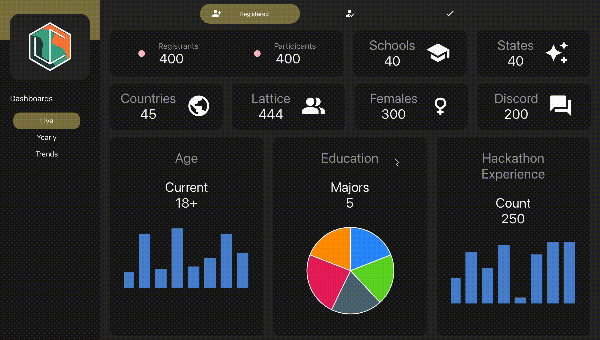

# React Dashboard

React Dashboard is a repository built for RevolutionUC (Spring Hackathon at University of Cincinnati) for Statistics Page. The primary focus was to built clean dashboards to display important data which in-turn would be used for data-driven marketing.

The project has the implementation of the following dashboards:
1. Live Dashboard

   

2. Yearly Dashboard

   
   
3. Trends Dashboard

    
   
## Usage
### Libraries
- React
- Styled-Components
- Material-UI
- React ApexCharts


### How To Use The Project
If you want to work off of this base to create your own Dashboard or Statistics Page, feel free to fork this project.


### How To Install The Project
1. Open terminal and clone the repository:
```
git clone https://github.com/faldund7/react-dashboard.git
```
2. Install all the dependencies of the project
```
yarn install
```
3. In the project directory, you can run the app in development mode.
```
yarn start
```


### How To Contribute To The Project
- Create a personal fork of the project on Github.
- Clone the fork on your local machine. Your remote repo on Github is called origin.
- Add the original repository as a remote called upstream.
- If you created your fork a while ago be sure to pull upstream changes into your local repository.
- Create a new branch to work on! Branch from develop if it exists, else from master.
- Implement/fix your feature, comment your code.
- Follow the code style of the project, including indentation.
- If the project has tests run them!
- Write or adapt tests as needed.
- Add or change the documentation as needed.
- Squash your commits into a single commit with git's interactive rebase. Create a new branch if necessary.
- Push your branch to your fork on Github, the remote origin.
- From your fork open a pull request in the correct branch. Target the project's develop branch if there is one, else go for master!
- Once the pull request is approved and merged you can pull the changes from upstream to your local repo and delete your extra branch(es).


## Available Scripts

In the project directory, you can run:

### `yarn start`

Runs the app in the development mode.\
Open [http://localhost:3000](http://localhost:3000) to view it in the browser.

The page will reload if you make edits.\
You will also see any lint errors in the console.

### `yarn test`

Launches the test runner in the interactive watch mode.\
See the section about [running tests](https://facebook.github.io/create-react-app/docs/running-tests) for more information.

### `yarn build`

Builds the app for production to the `build` folder.\
It correctly bundles React in production mode and optimizes the build for the best performance.

The build is minified and the filenames include the hashes.\
Your app is ready to be deployed!

See the section about [deployment](https://facebook.github.io/create-react-app/docs/deployment) for more information.

### `yarn eject`

**Note: this is a one-way operation. Once you `eject`, you can’t go back!**

If you aren’t satisfied with the build tool and configuration choices, you can `eject` at any time. This command will remove the single build dependency from your project.

Instead, it will copy all the configuration files and the transitive dependencies (webpack, Babel, ESLint, etc) right into your project so you have full control over them. All of the commands except `eject` will still work, but they will point to the copied scripts so you can tweak them. At this point you’re on your own.

You don’t have to ever use `eject`. The curated feature set is suitable for small and middle deployments, and you shouldn’t feel obligated to use this feature. However we understand that this tool wouldn’t be useful if you couldn’t customize it when you are ready for it.
